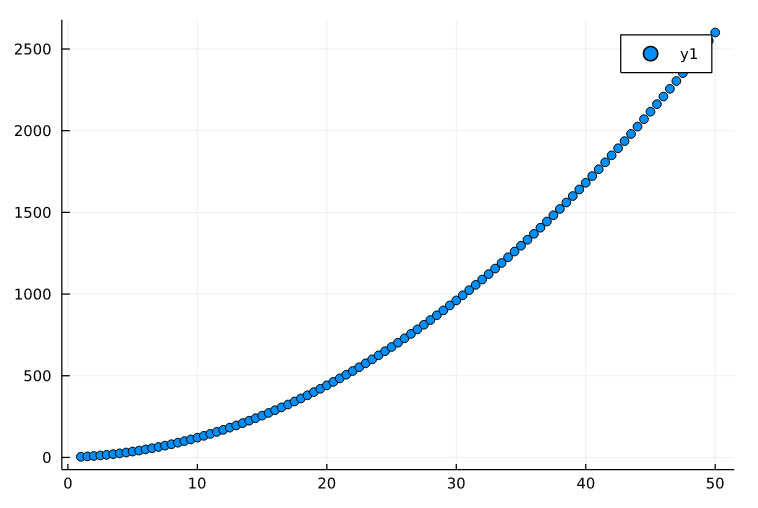
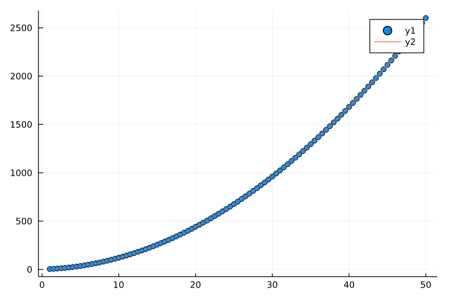

# Curve fitting for a Quadratic Polynomial using Zygote

## Polynomial used: &nbsp;$y = x^2+2x+1$
 

## General Polynomial taken: $f(x)=a_1x^2+b_1x+c_1$

 

## Assumed $a, b$ and $c$&nbsp;: 
### $a=0.5$, $b=1.5$ and $c=0.5$

 

## Using Loss Function, we try to minimise the loss, after which the obtained values for $a$, $b$ and $c$ were:

### $a=0.999926501000306$
### $b=2.0053678955175975$
### $c=0.9090524015188057$
### Clearly, the obtained values are pretty close to the assumed/expected values, and hence the curve fitting has been successfully accomplished

 

## Assumed curve:

 

 

## After Curve-Fitting:

 

